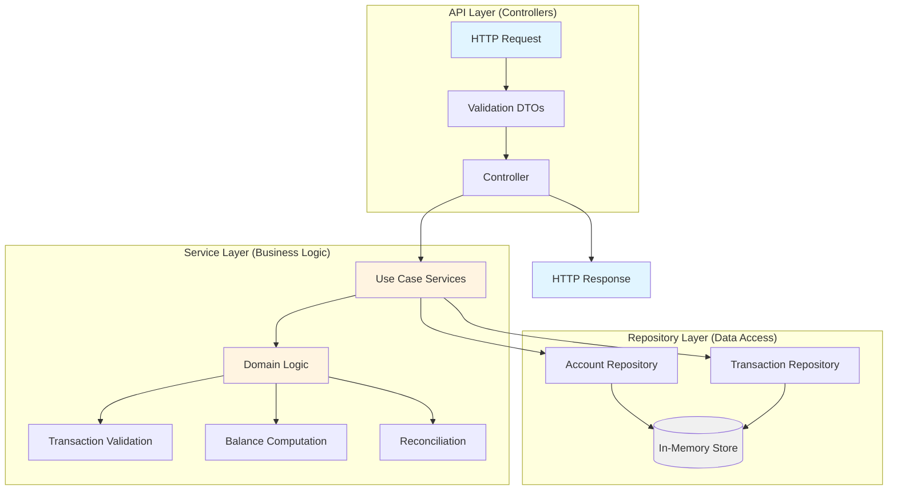

# Simple Ledger - Double-Entry Accounting System

A double-entry bookkeeping ledger built with NestJS and TypeScript, using in-memory storage.

## Overview

This system implements a double-entry ledger where every transaction is recorded as balanced entries (debits = credits). Accounts can only be modified through transactions, never directly.

## Setup & Running

### Option 1: Docker

The fastest way to run the application:

```bash
git clone https://github.com/dkribeiro/simple-ledger
cd simple-ledger
docker compose up
```

The server will be available at http://localhost:3000  
The swagger will be available at http://localhost:3000/docs

To stop the container:
```bash
docker compose down
```

To rebuild after code changes:
```bash
docker compose up --build
```

### Option 2: Local Installation

**Prerequisites**
- Node.js v20+
- npm v9+

**Installation**

```bash
git clone https://github.com/dkribeiro/simple-ledger
cd simple-ledger
npm install
```

**Development**

```bash
npm run start:dev
```

Server runs on http://localhost:3000
And the swagger is at http://localhost:3000/docs

**Production**

```bash
npm run build
npm run start:prod
```

### Testing

```bash
# Unit tests
npm test

# E2E tests  
npm run test:e2e

# Coverage
npm run test:cov

# Lint
npm run lint
```

## API Endpoints

### Create Account
**POST** `/accounts`

```bash
curl -X POST http://localhost:3000/accounts \
  -H 'Content-Type: application/json' \
  -d '{
    "id": "71cde2aa-b9bc-496a-a6f1-34964d05e6fd",
    "name": "Cash Account",
    "direction": "debit"
  }'
```

**Response**:
```json
{
  "id": "71cde2aa-b9bc-496a-a6f1-34964d05e6fd",
  "name": "Cash Account",
  "direction": "debit",
  "balance": 0
}
```

### Get Account
**GET** `/accounts/:id`

Returns account with computed balance.

```bash
curl http://localhost:3000/accounts/71cde2aa-b9bc-496a-a6f1-34964d05e6fd
```

### Create Transaction
**POST** `/transactions`

```bash
curl -X POST http://localhost:3000/transactions \
  -H 'Content-Type: application/json' \
  -d '{
    "name": "Payment for services",
    "entries": [
      {
        "account_id": "fa967ec9-5be2-4c26-a874-7eeeabfc6da8",
        "direction": "debit",
        "amount": 10000
      },
      {
        "account_id": "dbf17d00-8701-4c4e-9fc5-6ae33c324309",
        "direction": "credit",
        "amount": 10000
      }
    ]
  }'
```

**Note**: Amounts are in cents (10000 = $100.00).

### System Reconciliation
**POST** `/accounts/reconcile-all`

Reconciles all unreconciled transactions.

```bash
curl -X POST http://localhost:3000/accounts/reconcile-all
```

## Interactive API Documentation

**Swagger UI**: http://localhost:3000/docs

Full OpenAPI documentation with interactive "Try it out" functionality.

## Architecture

### Layered Design

The project uses a three-layer architecture separating HTTP handling, business logic, and data access:



**1. API/Controller Layer** (`*.controller.ts`)
- Handles HTTP requests and responses
- Validates input using DTOs
- Delegates to service layer
- No business logic

**2. Service Layer** (`use-cases/*.service.ts`)
- Contains all business logic
- Framework-agnostic (no NestJS dependencies in logic)
- Enforces accounting rules
- Orchestrates repositories
- Fully testable without HTTP layer

**3. Repository/Data Layer** (`data/*.repository.ts`)
- Abstracts data persistence
- Currently uses in-memory `Map<string, Entity>`
- Could be swapped for PostgreSQL without changing services

### Folder Structure

```
/src
├── /accounts                          # Accounts Domain
│   ├── /data
│   │   ├── account.entity.ts          # Account entity
│   │   └── account.repository.ts      # Data access
│   ├── /dto
│   │   ├── create-account.dto.ts      # Request DTOs
│   │   └── account-response.dto.ts    # Response DTOs
│   ├── /use-cases
│   │   ├── /create-account            
│   │   │   ├── create-account.service.ts
│   │   │   ├── create-account.controller.ts
│   │   │   └── *.spec.ts              # Tests
│   │   └── /get-account
│   └── accounts.module.ts
│
├── /transactions                      # Transactions Domain
│   ├── /data
│   │   ├── transaction.entity.ts      
│   │   └── transaction.repository.ts  
│   ├── /dto
│   │   └── create-transaction.dto.ts
│   ├── /shared
│   │   └── validate-transaction-balance.ts
│   ├── /use-cases
│   │   ├── /create-transaction
│   │   ├── /compute-balance
│   │   └── /reconciliation
│   └── transactions.module.ts
│
├── app.module.ts
└── main.ts
```

## Key Design Decisions

### 1. Integers for Monetary Values

All monetary amounts are stored as **integers** (cents) instead of floats.

**Reason**: Floating-point arithmetic has precision errors. `0.1 + 0.2 = 0.30000000000000004` in JavaScript.

```typescript
// Implementation
{ amount: 12345 }  // Represents $123.45
```

### 2. Atomic Transaction Simulation

Transaction creation follows a **validate → build → commit** pattern.

**Implementation** (`CreateTransactionService`):

```typescript
execute(dto: CreateTransactionDto) {
  // 1. VALIDATION - Fail fast
  validateTransactionBalance(dto.entries);
  dto.entries.forEach(line => {
    this.accountRepository.findByIdOrFail(line.account_id);
  });

  // 2. BUILD - Prepare in memory
  const lines = dto.entries.map(/* ... */);

  // 3. COMMIT - Save atomically with rollback
  return this.saveTransactionLinesAtomically(lines);
}
```

If any save fails, all previous saves are rolled back. This simulates SQL `BEGIN/COMMIT/ROLLBACK`.

### 3. Event-Sourced Balances

Account balances are **computed on-read** rather than stored and updated.

**Formula**:
```
current_balance = closed_balance + sum(unreconciled_transactions)
```

**Approach comparison**:

| Traditional | This System |
|-------------|-------------|
| Update balance when transaction created | Append transaction only |
| Requires locking | No locks needed |
| Must handle race conditions | Naturally race-proof |
| Balance is stored value | Balance is calculated value |

**Example**:
```
Account created → closed_balance: 0
Transaction 1: +$100 [unreconciled] → balance = 0 + 100 = $1.00
Transaction 2: +$50  [unreconciled] → balance = 0 + 150 = $1.50
Reconciliation → closed_balance = 150, txns marked reconciled
Transaction 3: +$25  [unreconciled] → balance = 150 + 25 = $1.75
```

**Trade-off**: Must scan unreconciled transactions. Reconciliation addresses this by creating snapshots.

### 4. Reconciliation as Performance Optimization

Periodic reconciliation creates balance snapshots to avoid scanning all transaction history.

**Process**:
1. Mark all unreconciled transactions with `reconciled_at: Date`
2. Compute final balance for each affected account
3. Store in `closed_balance`
4. Future queries only sum `WHERE reconciled_at IS NULL`

**Frequency**: Runs automatically every hour via NestJS cron.

**Integrity**: Verifies all transaction groups balance to zero before reconciling.

### 5. Optimistic Locking

Reconciliation uses version numbers to handle concurrent updates.

```typescript
class Account {
  closed_balance: number;
  version: number;  // Increments on update
}

updateClosedBalance(id: string, newBalance: number, expectedVersion: number) {
  const account = this.findByIdOrFail(id);
  
  if (account.version !== expectedVersion) {
    throw new ConflictException('Version mismatch. Retry.');
  }
  
  account.closed_balance = newBalance;
  account.version = expectedVersion + 1;
}
```

The service retries with exponential backoff (up to 10 attempts).

### 6. Denormalized Data Model

Transaction lines include duplicated transaction metadata.

```typescript
class Transaction {
  id: string;                    // Unique line ID
  transaction_id: string;        // Groups lines together
  transaction_name?: string;     // Duplicated
  created_at: Date;              // Duplicated
  reconciled_at: Date | null;    // Duplicated
  account_id: string;
  amount: number;
  direction: 'debit' | 'credit';
}
```

**Reason**: Simpler than a normalized structure (1 entity vs 3). Minimal duplication cost for significant reduction in complexity.

### 7. Testing Strategy

Tests focus on business logic in services, not controllers.

**Coverage**:
- Unit tests for all service logic
- Edge cases: invalid input, duplicate IDs, unbalanced transactions
- E2E tests for complete flows
- Controller tests verify HTTP layer only

```
CreateAccountService: 19 tests
GetAccountService: 15 tests
CreateTransactionService: 14 tests
ComputeBalanceService: 26 tests
ReconciliationService: 23 tests
E2E: 14 tests
```

## Double-Entry Accounting Rules

| Account Direction | Entry Direction | Effect on Balance |
|-------------------|-----------------|-------------------|
| debit             | debit           | +amount           |
| credit            | credit          | +amount           |
| debit             | credit          | -amount           |
| credit            | debit           | -amount           |

## Production Considerations

This is a reference implementation. For production level ledger, there are some considerations to be addressed:

1. **Database**: Replace in-memory storage with PostgreSQL/MySQL
   - Add indexes on `transaction_id`, `account_id`, `reconciled_at`
   - Use native transactions for atomicity
2. **Worker Process**: Move reconciliation cron to separate service
3. **Job Queue**: Use Bull/BullMQ for background jobs
4. **Distributed Locking**: Add Redis locks for multi-instance deployments
5. **Pagination**: Add to list endpoints
6. **Rate Limiting**: Protect endpoints
7. **Observability**: Add logging, metrics, tracing
